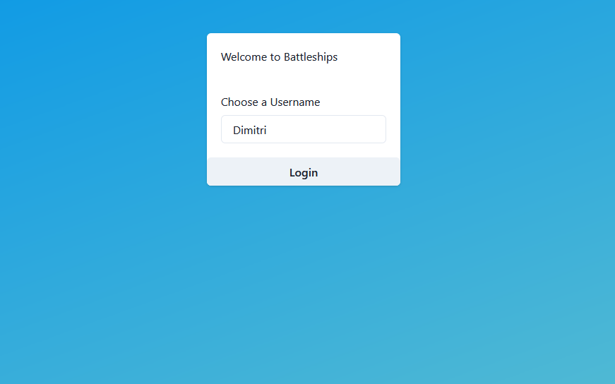

# Introduction

This repository represents a simple implementation of the classic game 'BattleShips'.
The goal of this repository is to showcase my coding style and programming abilities.

Problem Statement:
Program a simple version of the game Battleships. Create an application to allow a single human player to play a one-sided game of Battleships against ships placed by the computer.
The program should create a 10x10 grid, and place several ships on the grid at random with the following sizes:
1x Battleship (5 squares)
2x Destroyers (4 squares)
The player enters or selects coordinates of the form "A5", where "A" is the column and "5" is the row, to specify a square to target. Shots result in hits, misses or sinks. The game ends when all ships are sunk.

## Showcase

The game currently features simple username-based authentication and singleplayer against a rudimentary AI that copies your ship positions and shoots randomly.

Video
[](./assets/battleships-showcase.mp4)

Notes:
- The Enemy's ship positions are revealed if you hit any part of the ship
- The scope of the project is limited
- The Authentication flow is not supposed to be a comprehensive authentication flow
- It's quite hard for the AI to win as he shoots randomly

## Structure

```
├── Backend
│   └── BattleShipsAPI - .NET Core API Application
├── Frontend
│   └── battleships-frontend - React Frontend Application
├── assets
└── README.md
```

## Installation

### Frontend
Requires:
- [node 14.17](https://nodejs.org/en/blog/release/v14.17.3/)
- [npm 6.14](https://www.npmjs.com/package/npm/v/6.14.14)

Runs at http://localhost:3000
Steps:
1. `cd Frontend/battleships-frontend`
2. `npm install`
3. `npm run start`

### Backend
Requires:
- [.NET SDK 6](https://dotnet.microsoft.com/en-us/download/dotnet/6.0)
- [ASP.NET Core Runtime 6](https://dotnet.microsoft.com/en-us/download/dotnet/6.0)

Runs at https://localhost:7037
Steps:
1. `cd Backend/battleships-backend`
2. `dotnet restore`
3. `dotnet build`
4. `dotnet run`

Finally
Go to [localhost:3000](http://localhost:3000)

## Contact
For any difficulties or questions, please contact me at
[horaceduma@gmail.com](mailto:horaceduma@gmail.com)